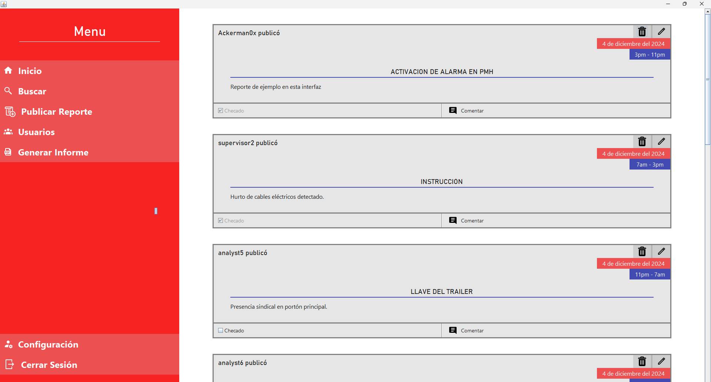

# Sistema de Registro de Novedades - FerromineraReport

Este proyecto es una aplicación desarrollada en Java para gestionar y registrar reportes de novedades que ocurren en la empresa **Ferrominera Orinoco**. La aplicación permite a los usuarios crear, revisar y gestionar reportes de diferentes tipos de novedades, asegurando una comunicación efectiva y organizada dentro de la empresa.

## Funcionalidades principales

- **Gestión de reportes:** 
  - Crear, revisar, comentar, editar y eliminar reportes de novedades.
- **Roles de usuario:**
  - **Analista:** Puede crear nuevos reportes, revisarlos y añadir comentarios.
  - **Supervisor:** Tiene las mismas capacidades que el Analista, puede editar y eliminar reportes existentes.
  - **Super-Admin:** Además de las funciones del Supervisor, puede gestionar (crear, editar y eliminar) usuarios de la aplicación.
- **Generación de reportes en PDF:**
  - Permite generar informes mensuales o semanales (lunes a domingo) que resumen:
    - La cantidad total de reportes generados.
    - Un desglose de reportes por tipo de novedad.

## Herramientas

- **JDK 22**
- **Netbeans 20**

> [!NOTE]
> La arquitectura del proyecto esta basada en **MVC**.

## Imagenes

    

    

    

    

    

    

